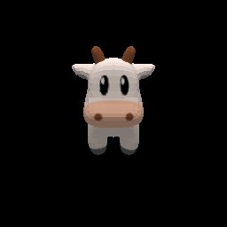
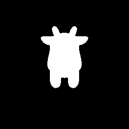

# Jrender (Jittor渲染库)

## 介绍

主要特性:

* 支持对.obj文件的加载和保存，支持对三角网格模型的渲染；
* 内置2个主流三角网格可微渲染器SoftRas和N3MR，支持快速切换可微渲染器；
* 内置多种shade算法、loss函数、投影函数；
* 使用CUDA进行渲染加速。

## 示例

### 示例1 使用2种不同的可微渲染器SoftRas和N3MR进行渲染

'''

    import jrender as jr

    # create a mesh object from args.filename_input
    mesh = jr.Mesh.from_obj(args.filename_input, load_texture=True, texture_res=5, texture_type='surface', dr_type='softras')

    # create a softras using default parameters
    renderer = jr.Renderer(dr_type='softras')

    # set the position of eyes
    renderer.transform.set_eyes_from_angles(2.732, 30, 0)

    # render the given mesh to a rgb or silhouette image
    rgb = renderer.render_mesh(mesh)
    silhouettes = renderer.render_mesh(mesh, mode='silhouettes')
'''

切换N3MR渲染器，只需要将dr_type全部换成n3mr即可。

'''

    import jrender as jr

    # create a mesh object from args.filename_input
    mesh = jr.Mesh.from_obj(args.filename_input, load_texture=True, texture_res=5, texture_type='surface', dr_type='n3mr')

    # create a softras using default parameters
    renderer = jr.Renderer(dr_type='n3mr')

    # set the position of eyes
    renderer.transform.set_eyes_from_angles(2.732, 30, 0)

    # render the given mesh to a rgb, silhouette or depth image
    rgb = renderer.render_mesh(mesh)
    silhouettes = renderer.render_mesh(mesh, mode='silhouettes')
    depth = renderer.render_mesh(mesh, mode='depth')
'''

参见[详细代码](https://github.com/zhouwy19/jrender/examples/render.py)。

N3MR渲染的带有纹理的结果和轮廓图结果如下：




Softras渲染的带有纹理的结果和轮廓图结果如下：


### 示例2 利用可微渲染器将球形变为飞机
'''

    import jrender as jr
    from jrender import neg_iou_loss, LaplacianLoss, FlattenLoss

    class Model(nn.Module):
        def __init__(self, template_path):
            super(Model, self).__init__()

            # set template mesh
            self.template_mesh = jr.Mesh.from_obj(template_path, dr_type='softras')
            self.vertices = (self.template_mesh.vertices * 0.5).stop_grad()
            self.faces = self.template_mesh.faces.stop_grad()
            self.textures = self.template_mesh.textures.stop_grad()

            # optimize for displacement map and center
            self.displace = jt.zeros(self.template_mesh.vertices.shape)
            self.center = jt.zeros((1, 1, 3))

            # define Laplacian and flatten geometry constraints
            self.laplacian_loss = LaplacianLoss(self.vertices[0], self.faces[0])
            self.flatten_loss = FlattenLoss(self.faces[0])

        def execute(self, batch_size):
            base = jt.log(self.vertices.abs() / (1 - self.vertices.abs()))
            centroid = jt.tanh(self.center)
            vertices = (base + self.displace).sigmoid() * nn.sign(self.vertices)
            vertices = nn.relu(vertices) * (1 - centroid) - nn.relu(-vertices) * (centroid + 1)
            vertices = vertices + centroid

            # apply Laplacian and flatten geometry constraints
            laplacian_loss = self.laplacian_loss(vertices).mean()
            flatten_loss = self.flatten_loss(vertices).mean()
            return jr.Mesh(vertices.repeat(batch_size, 1, 1), 
                        self.faces.repeat(batch_size, 1, 1), dr_type='softras'), laplacian_loss, flatten_loss

    # define a softras render
    renderer = jr.SoftRenderer(image_size=64, sigma_val=1e-4, aggr_func_rgb='hard', camera_mode='look_at', viewing_angle=15, dr_type='softras')

    for i in range(1000):
        # get the deformede mesh object, laplacian_loss, flatten_loss
        mesh, laplacian_loss, flatten_loss = model(args.batch_size)

        # render silhouettes image
        images_pred = renderer.render_mesh(mesh, mode='silhouettes')

        loss = neg_iou_loss(images_pred, images_gt[:, 3]) + \
                0.03 * laplacian_loss + \
                0.0003 * flatten_loss
        optimizer.step(loss)
'''

下图是从球模型变成飞机模型的过程，参见[详细代码](https://github.com/zhouwy19/jrender/examples/deform.py)。


### 示例3 使用Jrender进行人脸重建

我们在Jrender渲染库下复现了CVPR 2020 Best Paper，这篇paper利用可微渲染技术实现了无监督的人脸重建，我们的模型训练速度是PyTorch的1.31倍。参见[详细代码](https://github.com/Jittor/unsup3d-jittor)。

## Citation
```
@InProceedings{kato2018renderer
    title={Neural 3D Mesh Renderer},
    author={Kato, Hiroharu and Ushiku, Yoshitaka and Harada, Tatsuya},
    booktitle={The IEEE Conference on Computer Vision and Pattern Recognition (CVPR)},
    year={2018}
}

@article{liu2019softras,
  title={Soft Rasterizer: A Differentiable Renderer for Image-based 3D Reasoning},
  author={Liu, Shichen and Li, Tianye and Chen, Weikai and Li, Hao},
  journal={The IEEE International Conference on Computer Vision (ICCV)},
  month = {Oct},
  year={2019}
}
```