# Jrender 2.0 (Jittor渲染库)

## 渲染结果一览

<p align="left">
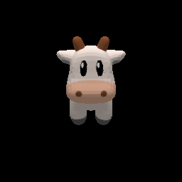
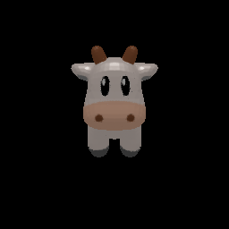

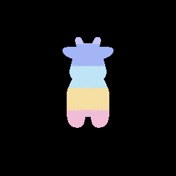


</p>

## 介绍

主要特性:

* 支持对.obj文件的加载和保存，支持对三角网格模型的渲染；
* 支持Volume Rendering；
* 内置2个主流三角网格可微渲染器SoftRas和N3MR，支持快速切换可微渲染器；
* 支持金属度、粗糙度材质渲染；
* 内置多种loss函数、投影函数；
* 使用CUDA进行渲染加速，渲染速度优于PyTorch。

## 示例

## 基础教程

* [基础教程1：渲染物体](#基础教程1：渲染物体)
* [基础教程2：优化模型几何](#基础教程2：优化模型几何)
* [基础教程3：渲染Specular材质](#基础教程3：渲染Specular材质)
* [基础教程4：优化纹理](#基础教程4：优化纹理)
* [基础教程5：优化金属度贴图](#基础教程5：优化金属度贴图)
* [基础教程6：优化粗糙度贴图](#基础教程6：粗糙度贴图)

## 进阶教程

* [进阶教程1：ShapeNet数据集三维重建](#进阶教程1：ShapeNet数据集三维重建)
* [进阶教程2：人脸重建](#进阶教程2：人脸重建)
* [进阶教程3：NERF](#进阶教程3：NERF)

## 使用

使用JRender前需要安装好Jittor，Jittor安装方法在[此处](https://github.com/Jittor/jittor)。

此外安装以下包：

```
jittor
imageio==2.9.0
imageio-ffmpeg==0.4.3
matplotlib==3.3.0
configargparse==1.3
tensorboard==1.14.0
tqdm==4.46.0
opencv-python==4.2.0.34
```

接着使用下面的命令即可跑jrender的各种demo。

```
git clone https://github.com/jittor/jrender.git
cd jrender
python demo1-render.py
python demo2-deform
python demo3-render_specular.py
python demo4-optim_textures.py
python demo5-optim_metallic_textures.py
python demo6-optim_roughness_textures.py
```

## 速度对比

我们对PyTorch和Jittor渲染一个带有纹理的奶牛以及球形变为飞机做了时间对比测试，测试环境如下。

* cuda: 10.2
* torch: 1.6.0
* soft-renderer: 1.0.0

测试结果：

渲染小模型（642顶点）速度对比（渲染1080次）：

|           | JRender渲染时间   | PyTorch渲染时间 | 加速比 |
|  ----     | ----          | ----  | ----  |
| N3MR    | 3.56        | 19.45 | 5.46 |
| Softras   | 3.54      | 5.83  | 1.64 |

渲染大模型（11420顶点）速度对比（渲染1080次）：

|           | JRender渲染时间   | PyTorch渲染时间 | 加速比 |
|  ----     | ----          | ----  | ----  |
| N3MR    | 4.99        | 65.07 | 13.04 |
| Softras   | 12.46        | 18.58 | 1.49 |

|           | 飞机形变优化时间   |
|  ----     | ----          |
| Jittor    | 19.58        |
| PyTorch   | 32.88        |
| 加速比   | 1.67           |

## 基础教程

### 基础教程1：渲染物体

该教程使用JRender渲染一个奶牛。

    import jrender as jr
    
    # create a mesh object from args.filename_input
    mesh = jr.Mesh.from_obj(args.filename_input, load_texture=True, texture_res=5, texture_type='surface', dr_type='softras')
    
    # create a softras using default parameters
    renderer = jr.Renderer(dr_type='softras')
    
    # set the position of eyes
    renderer.transform.set_eyes_from_angles(2.732, 30, 0)
    
    # render the given mesh to a rgb or silhouette image
    rgb = renderer.render_mesh(mesh)
    silhouettes = renderer.render_mesh(mesh, mode='silhouettes') # or mode = 'rgb'

渲染的带有纹理的结果和轮廓图结果如下，参见[详细代码](https://github.com/Jittor/jrender/blob/main/demo1-render.py)。

<p align="left">

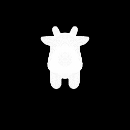
</p>

### 基础教程2：优化模型几何

该教程利用可微渲染器将球形变为飞机。

    import jrender as jr
    from jrender import neg_iou_loss, LaplacianLoss, FlattenLoss
    
    class Model(nn.Module):
        def __init__(self, template_path):
            super(Model, self).__init__()
    
            # set template mesh
            self.template_mesh = jr.Mesh.from_obj(template_path, dr_type='softras')
            self.vertices = (self.template_mesh.vertices * 0.5).stop_grad()
            self.faces = self.template_mesh.faces.stop_grad()
            self.textures = self.template_mesh.textures.stop_grad()
    
            # optimize for displacement map and center
            self.displace = jt.zeros(self.template_mesh.vertices.shape)
            self.center = jt.zeros((1, 1, 3))
    
            # define Laplacian and flatten geometry constraints
            self.laplacian_loss = LaplacianLoss(self.vertices[0], self.faces[0])
            self.flatten_loss = FlattenLoss(self.faces[0])
    
        def execute(self, batch_size):
            base = jt.log(self.vertices.abs() / (1 - self.vertices.abs()))
            centroid = jt.tanh(self.center)
            vertices = (base + self.displace).sigmoid() * nn.sign(self.vertices)
            vertices = nn.relu(vertices) * (1 - centroid) - nn.relu(-vertices) * (centroid + 1)
            vertices = vertices + centroid
    
            # apply Laplacian and flatten geometry constraints
            laplacian_loss = self.laplacian_loss(vertices).mean()
            flatten_loss = self.flatten_loss(vertices).mean()
            return jr.Mesh(vertices.repeat(batch_size, 1, 1), 
                        self.faces.repeat(batch_size, 1, 1), dr_type='softras'), laplacian_loss, flatten_loss
    
    # define a softras render
    renderer = jr.SoftRenderer(image_size=64, sigma_val=1e-4, aggr_func_rgb='hard', camera_mode='look_at', viewing_angle=15, dr_type='softras')
    
    for i in range(1000):
        # get the deformede mesh object, laplacian_loss, flatten_loss
        mesh, laplacian_loss, flatten_loss = model(args.batch_size)
    
        # render silhouettes image
        images_pred = renderer.render_mesh(mesh, mode='silhouettes')
    
        loss = neg_iou_loss(images_pred, images_gt[:, 3]) + \
                0.03 * laplacian_loss + \
                0.0003 * flatten_loss
        optimizer.step(loss)

下图是从球模型变成飞机模型的过程，参见[详细代码](https://github.com/Jittor/jrender/blob/main/demo2-deform.py)。


### 基础教程3：渲染Specular材质

我们在Jrender渲染库中实现了Microfacet模型，可以支持Specular材质渲染。用户可以通过我们的API传入金属度贴图和粗糙度贴图来控制Specular材质的样式，获得具有不同光泽特性的渲染结果。

    # load from Wavefront .obj file
    mesh = jr.Mesh.from_obj(args.filename_input, load_texture=True, texture_res=5 ,texture_type='surface', dr_type='softras')
    
    # create renderer with SoftRas
    renderer = jr.Renderer(dr_type='softras')
    
    #Roughness/Metallic setup 0.5 0.4
    metallic_textures = jt.zeros((1, mesh.faces.shape[1], 5 * 5, 1)).float32() + 0.5
    roughness_textures = jt.zeros((1, mesh.faces.shape[1], 5 * 5, 1)).float32() + 0.4
    
    # draw object from different view
    loop = tqdm.tqdm(list(range(0, 360, 4)))
    writer = imageio.get_writer(os.path.join(args.output_dir, 'rotation.gif'), mode='I')
    imgs = []
    from PIL import Image
    for num, azimuth in enumerate(loop):
        # rest mesh to initial state
        mesh.reset_()
        loop.set_description('Drawing rotation')
        renderer.transform.set_eyes_from_angles(camera_distance, elevation, azimuth)
        rgb = renderer(mesh.vertices, mesh.faces, textures=mesh.textures, metallic_textures=metallic_textures, roughness_textures=roughness_textures)
        image = rgb.numpy()[0].transpose((1, 2, 0))
        writer.append_data((255*image).astype(np.uint8))
    writer.close()

带有粗糙度和金属度贴图的渲染结果如下,参见[详细代码](https://github.com/Jittor/jrender/blob/main/demo3-render_specular.py)。


### 基础教程4：优化纹理

    class Model(nn.Module):
    def __init__(self, filename_obj, filename_ref):
        super(Model, self).__init__()
    
        # set template mesh
        self.template_mesh = jr.Mesh.from_obj(filename_obj, dr_type='softras')
        self.vertices = (self.template_mesh.vertices * 0.6).stop_grad()
        self.faces = self.template_mesh.faces.stop_grad()
        # self.textures = self.template_mesh.textures
        texture_size = 4
        self.textures = jt.zeros((1, self.faces.shape[1], texture_size, texture_size, texture_size, 3)).float32()
    
        # load reference image
        self.image_ref = jt.array(imread(filename_ref).astype('float32') / 255.).permute(2,0,1).unsqueeze(0).stop_grad()
    
        # setup renderer
        self.renderer = jr.Renderer(camera_mode='look_at', perspective=False, light_intensity_directionals=0.0, light_intensity_ambient=1.0, dr_type='softras')
    
    def execute(self):
        num = np.random.uniform(0, 360)
        self.renderer.transform.set_eyes_from_angles(2.732, 0, num)
        image = self.renderer(self.vertices, self.faces, jt.tanh(self.textures))
        loss = jt.sum((image - self.image_ref).sqr())
        return loss
    
    model = Model(args.filename_obj, args.filename_ref)
    
    optimizer = nn.Adam([model.textures], lr=0.1, betas=(0.5,0.999))
    loop = tqdm.tqdm(range(300))
    for num in loop:
        loop.set_description('Optimizing')
        loss = model()
        optimizer.step(loss)

下图是纹理的优化结果，从左到右分别是优化目标纹理图像和优化结果，参见[详细代码](https://github.com/jittor/jrender/blob/main/demo4-optim_textures.py)。

<p align="left">


</p>

### 基础教程5：优化金属度贴图

    class Model(nn.Module):
        def __init__(self, filename_obj, filename_ref):
            super(Model, self).__init__()
    
            # set template mesh
            texture_size = 4
            self.template_mesh = jr.Mesh.from_obj(filename_obj, texture_res=texture_size,load_texture=True, dr_type='softras')
            self.vertices = (self.template_mesh.vertices).stop_grad()
            self.faces = self.template_mesh.faces.stop_grad()
            self.textures = self.template_mesh.textures.stop_grad()
            self.metallic_textures = jt.zeros((1, self.faces.shape[1], texture_size * texture_size, 1)).float32()
            self.roughness_textures = jt.zeros((1, self.faces.shape[1], texture_size * texture_size, 1)).float32() + 0.5
            self.roughness_textures = self.roughness_textures.stop_grad()
            # load reference image
            self.image_ref = jt.array(imread(filename_ref).astype('float32') / 255.).permute(2,0,1).unsqueeze(0).stop_grad()
            # setup renderer
            self.renderer = jr.Renderer(dr_type='softras', light_intensity_directionals=1.0, light_intensity_ambient=0.0)
    
        def execute(self):
            self.renderer.transform.set_eyes_from_angles(2.732, 30, 140)
            image = self.renderer(self.vertices, self.faces, self.textures, metallic_textures=self.metallic_textures, roughness_textures=self.roughness_textures)
            loss = jt.sum((image - self.image_ref).sqr())
            return loss


    model = Model(args.filename_obj, args.filename_ref)
    
    optimizer = nn.Adam([model.metallic_textures], lr=0.1, betas=(0.5,0.999))
    loop = tqdm.tqdm(range(20))
    for num in loop:
        loop.set_description('Optimizing')
        loss = model()
        optimizer.step(loss)

下图是金属度贴图的优化过程，从左到右分别是起始模型、优化目标图像和优化过程，参见[详细代码](https://github.com/jittor/jrender/blob/main/demo5-optim_metallic_textures.py)。

<p align="left">
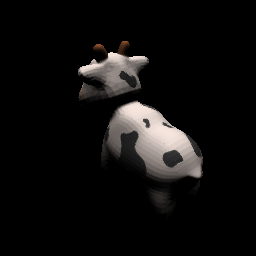
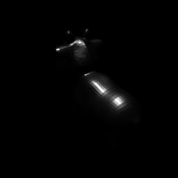

</p>


### 基础教程6：优化粗糙度贴图
    class Model(nn.Module):
        def __init__(self, filename_obj, filename_ref):
            super(Model, self).__init__()
    
            # set template mesh
            texture_size = 4
            self.template_mesh = jr.Mesh.from_obj(filename_obj, texture_res=texture_size,load_texture=True, dr_type='softras')
            self.vertices = (self.template_mesh.vertices).stop_grad()
            self.faces = self.template_mesh.faces.stop_grad()
            self.textures = self.template_mesh.textures.stop_grad()
            self.metallic_textures = jt.zeros((1, self.faces.shape[1], texture_size * texture_size, 1)).float32() + 0.4
            self.metallic_textures = self.metallic_textures.stop_grad()
            self.roughness_textures = jt.ones((1, self.faces.shape[1], texture_size * texture_size, 1)).float32()
            # load reference image
            self.image_ref = jt.array(imread(filename_ref).astype('float32') / 255.).permute(2,0,1).unsqueeze(0).stop_grad()
            # setup renderer
            self.renderer = jr.Renderer(dr_type='softras')
    
        def execute(self):
            self.renderer.transform.set_eyes_from_angles(2.732, 30, 140)
            image = self.renderer(self.vertices, self.faces, self.textures, metallic_textures=self.metallic_textures, roughness_textures=self.roughness_textures)
            loss = jt.sum((image - self.image_ref).sqr())
            return loss
    
    def main():
        model = Model(args.filename_obj, args.filename_ref)
    
        optimizer = nn.Adam([model.roughness_textures], lr=0.1, betas=(0.5,0.999))
        loop = tqdm.tqdm(range(15))
        for num in loop:
            loop.set_description('Optimizing')
            loss = model()
            optimizer.step(loss)


下图是粗糙度贴图的优化过程，从左到右分别是起始模型、优化目标图像和优化过程，参见[详细代码](https://github.com/jittor/jrender/blob/main/demo6-optim_roughness_textures.py)。

<p align="left">
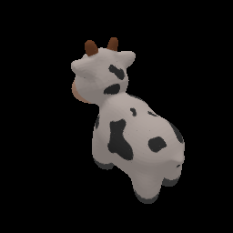


</p>

## 进阶教程

### 进阶教程1：ShapeNet数据集三维重建

我们使用JRender对ShapeNet数据集进行了三维重建，模型的训练速度是PyTorch的1.22倍。参见[详细代码](https://github.com/Jittor/shapenet-reconstruction-jittor)。

### 进阶教程2：人脸重建

我们在JRender渲染库下复现了CVPR 2020 Best Paper，这篇paper利用可微渲染技术实现了无监督的人脸重建，我们的模型训练速度是PyTorch的1.31倍。参见[详细代码](https://github.com/Jittor/unsup3d-jittor)。

### 进阶教程3：NERF

Jrender 2.0版本新推出了Volume Rendering功能，基于该新特性，我们复现了发表于ECCV 2020的NERF，该论文利用神经辐射场表示场景，对合成场景及真实场景都可恢复到真实感渲染级效果。

Jittor版本的NERF训练前需要下载数据集，下载后运行方法如下。

```
bash download_example_data.sh
python nerf.py --config configs/lego.txt
```

下图是NERF在合成场景下的渲染效果：

<p align="left">
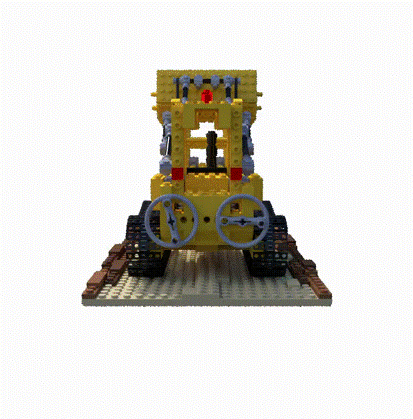
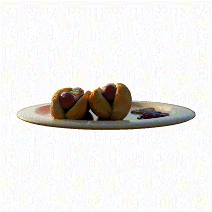
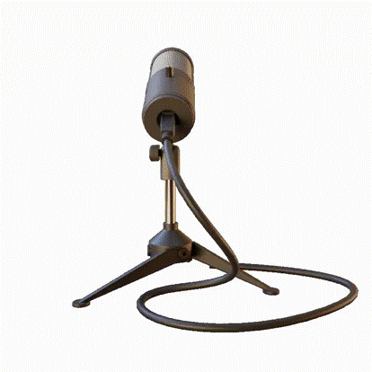
</p>


下图是NERF在真实场景下的渲染效果：

<p align="left">
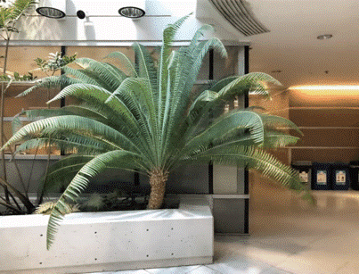
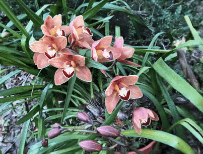
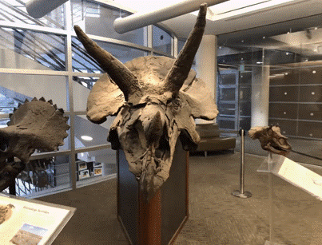
</p>


基于Jittor版本的NERF比Pytoch版本的NERF在速度上有明显优势，我们的训练速度是Pytorch版本的1.92-2.27倍，在不同数据集上具体的迭代速度如下：

<p align="left">
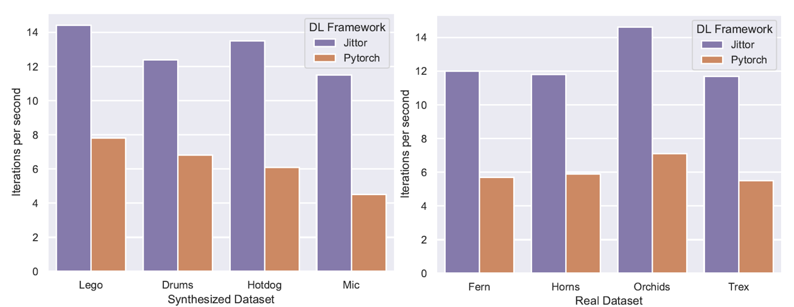
</p>


## Citation

如果您在自己的研究工作中使用了JRender，请引用Jittor的论文。
```
@article{hu2020jittor,
  title={Jittor: a novel deep learning framework with meta-operators and unified graph execution},
  author={Hu, Shi-Min and Liang, Dun and Yang, Guo-Ye and Yang, Guo-Wei and Zhou, Wen-Yang},
  journal={Science China Information Sciences},
  volume={63},
  number={222103},
  pages={1--222103},
  year={2020}
}
```

同时，本渲染器内置了N3MR和SoftRas两个可微渲染器，若您在研究中使用了渲染器，请您引用相应的论文。
```
@InProceedings{kato2018renderer
    title={Neural 3D Mesh Renderer},
    author={Kato, Hiroharu and Ushiku, Yoshitaka and Harada, Tatsuya},
    booktitle={The IEEE Conference on Computer Vision and Pattern Recognition (CVPR)},
    year={2018}
}

@article{liu2019softras,
  title={Soft Rasterizer: A Differentiable Renderer for Image-based 3D Reasoning},
  author={Liu, Shichen and Li, Tianye and Chen, Weikai and Li, Hao},
  journal={The IEEE International Conference on Computer Vision (ICCV)},
  month = {Oct},
  year={2019}
}
```
